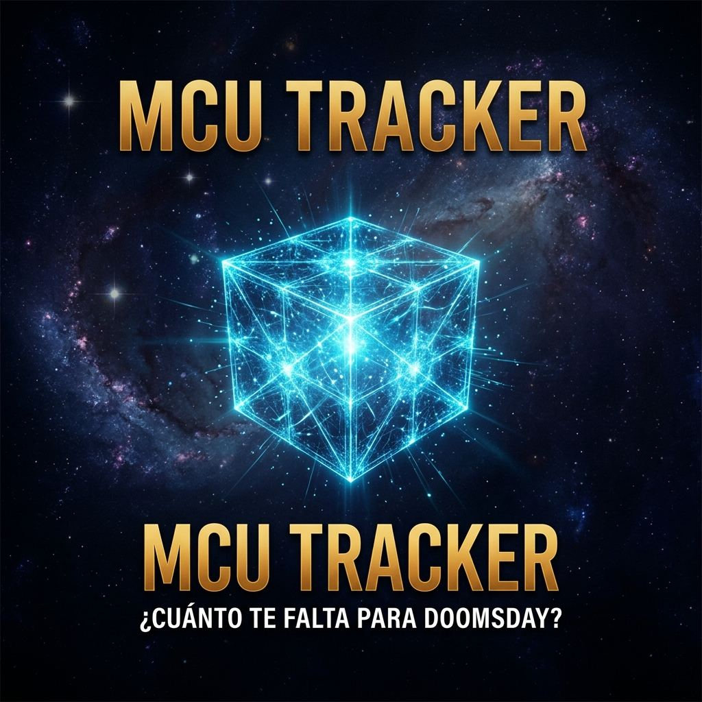

# MCU Tracker — ¿Cuánto me falta para el reset del MCU?

**[losfiebruos.lat](https://losfiebruos.lat/)** — Checklist interactivo para llevar la cuenta de todas las películas y series del Universo Cinematográfico de Marvel antes de *Avengers: Doomsday* y el gran reset en *Avengers: Secret Wars*.



## Features

- **4 modos**: ⚡ 5 Rápidas (lo mínimo imprescindible), Fast Track (lo esencial), Maratón completo (todo, incluyendo Pre-UCM: X-Men, Blade, Spider-Man de Tobey) y el avance del Dueño (solo lectura).
- **Progreso sincronizado** entre modos: marcar *Endgame* en 5 Rápidas la marca también en Maratón.
- **Series con episodios**: marca episodio por episodio, con cascada serie↔episodios.
- **Tesseract 3D** que se carga de energía con tu porcentaje de progreso.
- **Cuenta regresiva** al próximo estreno y **ritmo diario** necesario para llegar al reset.
- **Filtros**: búsqueda (insensible a acentos), por plataforma de streaming (LATAM) y ocultar vistos.
- **Estadísticas**: desglose por fase y plataforma, tiempo visto/restante y racha de días.
- **Exportar / importar** progreso como JSON, **compartir por link** (bitmask en la URL) o como **imagen PNG**.
- **PWA instalable** con soporte offline (service worker network-first).
- Accesible: navegación completa por teclado, ARIA, `prefers-reduced-motion`.

Todo en **vanilla JS sin build step** (servido tal cual por GitHub Pages), con CSP estricta y sin dependencias externas en runtime (fuentes self-hosteadas; Three.js vendoreado y cargado solo cuando el dispositivo lo aguanta).

## Desarrollo

```bash
# Servir localmente
python3 -m http.server 8000

# Tests (bun)
bun test

# Verificación de sintaxis + CSP (lo mismo que corre el CI)
bun run check
```

El progreso se guarda en `localStorage` (`mcu_tracker_watched`). Los datos de las obras viven en `data.js`; **ojo**: el orden de los arrays define el formato de los links de progreso compartidos — leer la advertencia en `progress-codec.js` antes de insertar items (el test `tests/data-integrity.test.js` lo vigila).

## Estructura

| Archivo | Qué es |
|---|---|
| `app.js` | Lógica principal de la UI (ES module) |
| `utils.js` / `progress-codec.js` | Funciones puras (testeadas con `bun test`) |
| `data.js` | Datasets: maratón, fast track, 5 rápidas |
| `releases.js` / `equivalences.js` / `owner_progress.js` | Fechas de estreno, equivalencias entre modos, progreso del dueño |
| `three-scene.js` | Fondo 3D decorativo (carga condicional de Three.js) |
| `countdown.js` | Cuenta regresiva al próximo estreno |
| `sw.js` | Service worker (PWA offline) |
